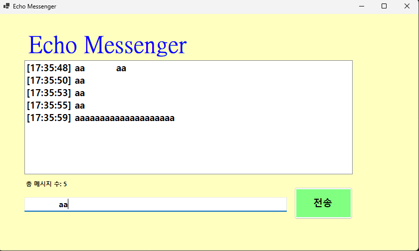
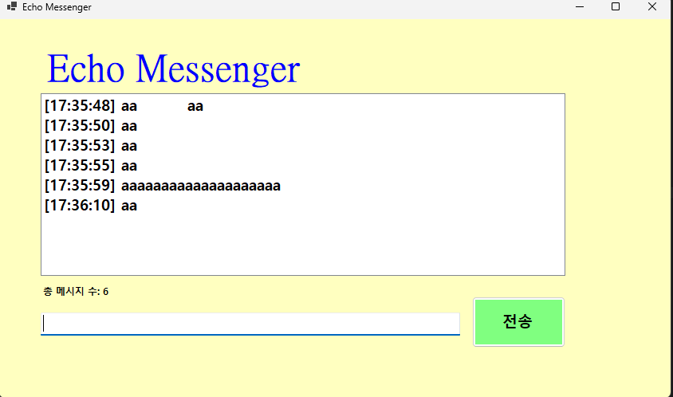
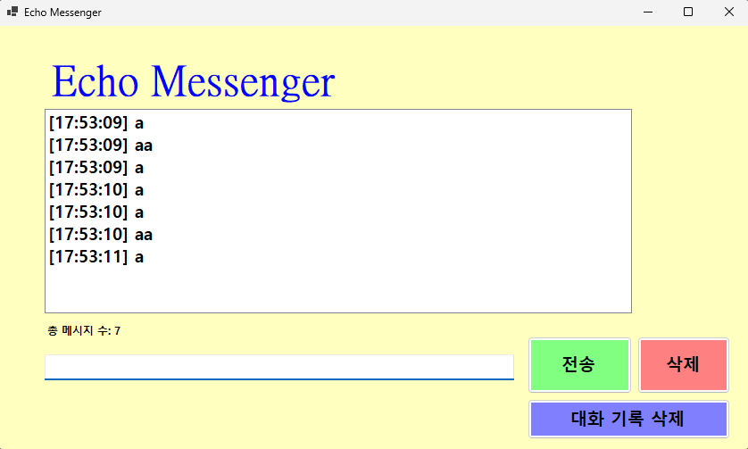
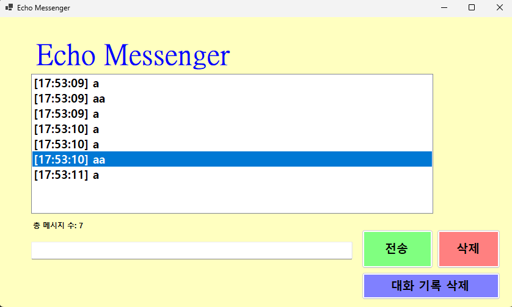
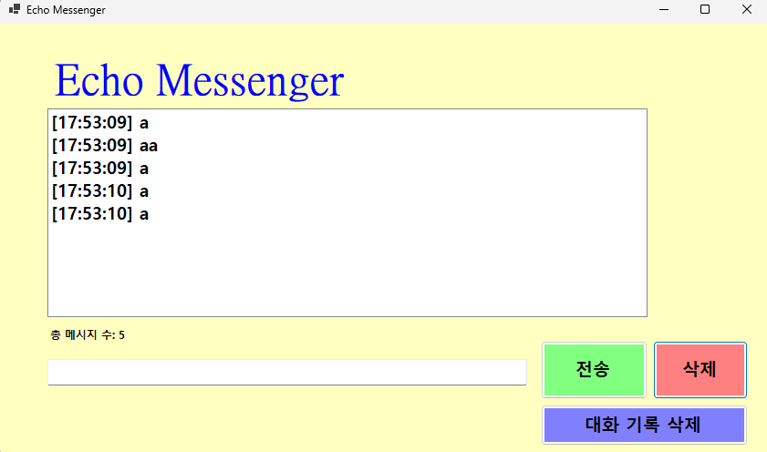
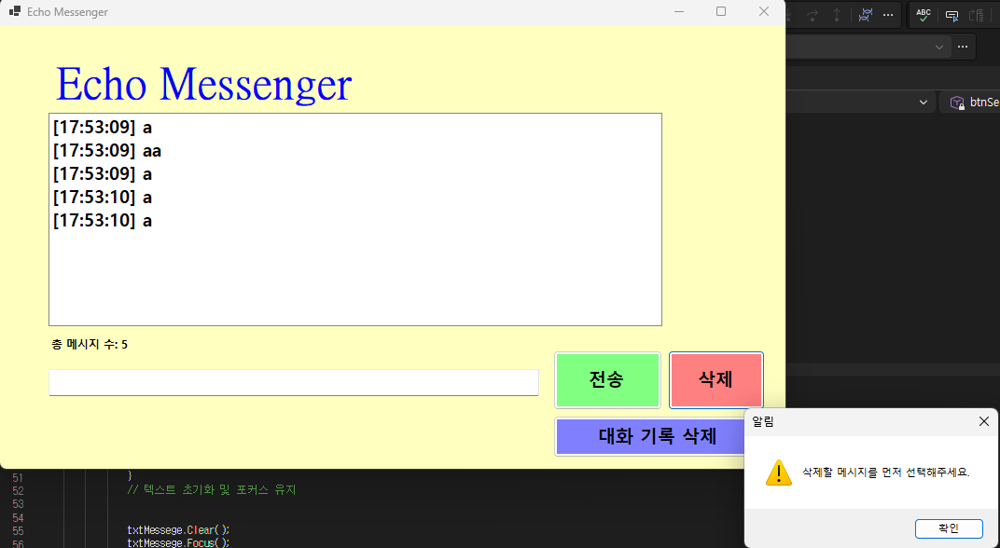
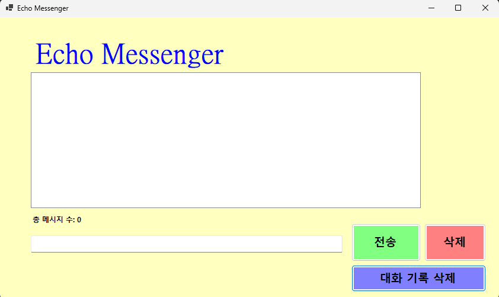
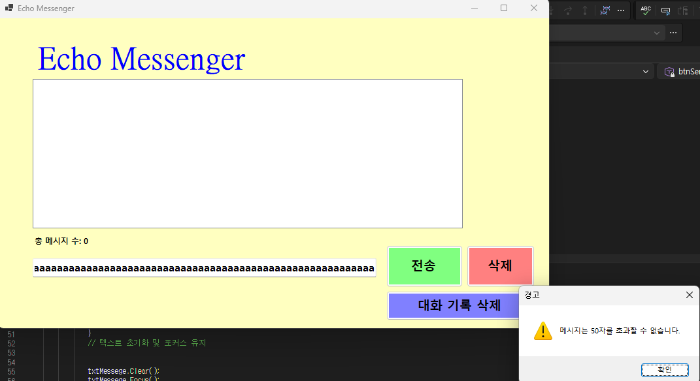

# (C# 코딩) 에코메신저
## 개요
C# 프로그래밍학습
-1줄소개: 사용자키보드입력을받아서처리하는프로그램
-사용한플랫폼: -C#, .NET Windows Forms, Visual Studio, GitHub
-사용한컨트롤:-Label, TextBox, ListBox, Button
-사용한기술과구현한기능:VS를 이용하요 UI디자인,string클래스를 이용하여 사용자 입룍 데이터 처리,DateTime클래스를 이용하여 시간정보처리
삭제버튼,메시지 갯수 제한,메시지 길이 제한 등 여러가지 버튼을 이용

## 실행화면(과제1)
-과제1코드의실행스크린샷

-과제내용
-Label(표시), TextBox(입력), Button(전송), ListBox(대화창)를 적절히 배치합니다.
-전송버튼 클릭시TextBox의 텍스트를 ListBox의 항목(Items)으로 추가합니다.
-추가직후 TextBox의 내용을 비워(Clear) 다음 입력을 준비합니다.

-구현내용과기능설명
-입력창에 메시지 입력하고 전송버튼을 누르면 메시지가 리스트박스에 표시됩니다.
-계속 반복하면 메시지가 리스트 박스에 한 줄씩 계속 추가됩니다.
-추가내용이 많아지면 리스트 박스에 스크롤 바가 자동으로 생기고 스크롤 됩니다.
-입력창 메시지 전송 후 텍스트 박스가 clear 되어 지우지 않아도 됩니다.

## 실행화면(과제2)
-과제2코드의실행스크린샷!=

-과제내용
-키보드 엔터를 눌러 전송 후에 다시 텍스트창을 누르는게 아닌 입력창에 입력 포커스를 갖다 놓아 계속 메시지를 입력하고 보낼수 있습니다.
-전송버튼 클릭 대신 키보드 엔터시에도 클릭과 같이 텍스트박스에서 리스트 박스로 전송합니다
-내용이 없는 빈 문자열을 입력시 입력이 되지 않게 입력방어를 합니다
-입력창 메시지 전송 후 텍스트 박스 clear 기능은 과제1에서 이미 추가했습니다

-구현내용과기능설명
-전송버튼 마우스 클릭 대신 엔터시 메시지가 전송됩니다
-텍스트가 없거나 공백만 있는 빈 항목은 엔터, 전송버튼 클릭시 보내지지 않습니다
-전송후에도 포커스가 유지되어 텍스트창을 마우스로 클릭하지 않고 연속으로 메시지 입력이 가능합니다
-입력창 메시지 전송 후 텍스트 박스 clear 기능은 과제 1에서 추가했습니다
## 실행화면(과제3)
-과제3코드의실행스크린샷!

-과제내용
-메시지 전송시 리스트 박스에서 전송될때의 현재 시간이 추가되어 전송되도록 합니다
-리스트 박스 아래에 리스트 박스로 보낸 총 메시지 개수가 메시지를 보내때마다 추가되도록 합니다
-메시지 앞 뒤로 불필요한 공백은 Trim()을 이용하여 제거하여 저장합니다.

-구현내용과기능설명
-메시지 전송시 텍스트박스에서 리스트박스로 이동 후 현재 시간을 (HH:mm:ss) 추가하여 리스트박스에 [HH:mm:ss]@@@ 이런 형식으로 저장됩니다.
-메시지 전송시, 전송후 실시간으로 현재 리스트 박스에 저장된 메시지 개수를 리스트박스 아래 라벨에 저장하고 추가하여 개수를 보여줍니다.
-문자열 앞,뒤에 불필요한 공백은 Trim()을 이용해 불필요한 공백을 제거하고 저장합니다.

## 실행화면(과제4)
-과제4코드의실행스크린샷!

-과제내용
-리스트박스에서 저장된 메시지를 선택하여 삭제할 수 있습니다
-메시지 삭제버튼을 메시지 선택하지 않고 클릭시 메시지를 선택하라는 경고문구가 뜨며, 메시지가 삭제되지 않습니다
-대화기록삭제 버튼을 추가하여 클릭시 리스트박스의 모든 메시지를 삭제하고 아래 라벨의 총 메시지 개수도 초기화합니다
-글자 수를 50자로 제한하여 50자 초과시 사용자에게 경고메시지를 띄우며 전송버튼을 차단하고 키보드 엔터를 눌러도 전송이 되지 않습니다

-구현내용과기능설명
-리스트 박스에 저장된 메시지를 마우스로 클릭 후 삭제 버튼을 눌러 삭제가 가능합니다
-리스트 박스에 저장된 메시지를 클릭하지 않고 삭제 버튼 클릭시 메시지를 선택하라는 경고 메시지창이 뜨며 리스트박스 내 메시지가 삭제되지 않습니다
-대화기록삭제 버튼을 추가하여 버튼클릭시 리스트박스 내 저장된 모든 메시지를 삭제하고 아래 라벨에 적혀있는 총 메시지 개수도 초기화하여 메시지 개수 0개로 처음으로 되돌립니다
-글자수 50자를 넘길시 글자수 초기화 경고메시지가 뜨며 전송버튼 클릭, 키보드 엔터를 눌러도 전송되지 않습니다. 그리고 포커스를 계속 유지하여 다시 입력할수 있게 합니다.
