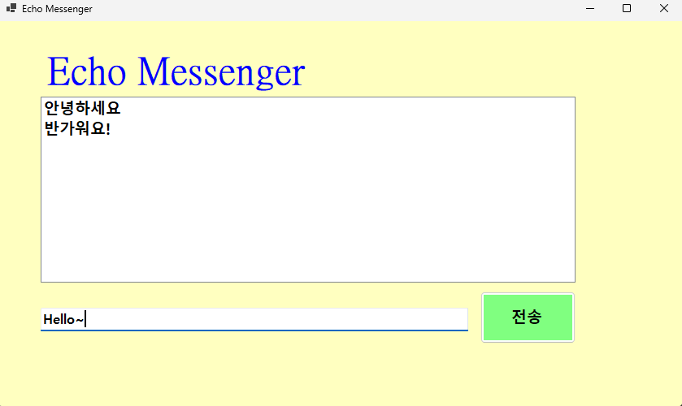
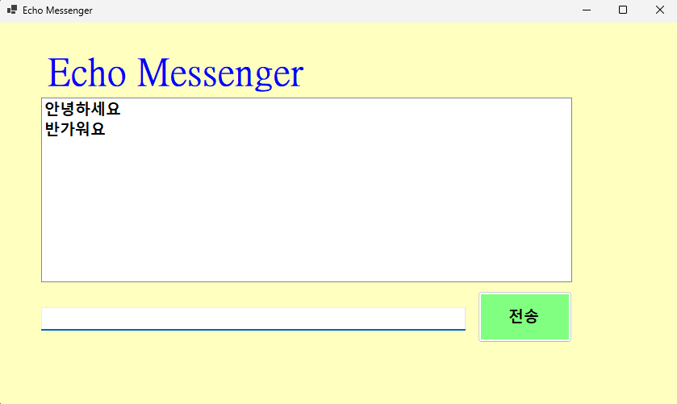

# (C# 코딩) 에코메신저
## 개요
C# 프로그래밍학습
-1줄소개: 사용자키보드입력을받아서처리하는프로그램
-사용한플랫폼: -C#, .NET Windows Forms, Visual Studio, GitHub
-사용한컨트롤:-Label, TextBox, ListBox, Button
-사용한기술과구현한기능:VS를 이용하요 UI디자인,string클래스를 이용하여 사용자 입룍 데이터 처리,DateTime클래스를 이용하여 시간정보처리
삭제버튼,메시지 갯수 제한,메시지 길이 제한 등 여러가지 버튼을 이용

## 실행화면(과제1)
-과제1코드의실행스크린샷

-과제내용
-Label(표시), TextBox(입력), Button(전송), ListBox(대화창)를적절히배치합니다.
-전송버튼클릭시TextBox의텍스트를ListBox의항목(Items)으로추가합니다.
-추가직후TextBox의내용을비워(Clear) 다음입력을준비합니다.

-구현내용과기능설명
-입력창에메시지입력하고전송버튼을누르면메시지가리스트박스에표시된다.
-계속반복하면메시지가리스트박스에한줄씩계속추가된다.
-추가내용이많아지면리스트박스에스크롤바가자동으로생기고스크롤된다.

## 실행화면(과제2)
-과제2코드의실행스크린샷!=

-과제내용
-입력창에 입력 포커스를 갖다놓습니다
-엔터키로 전송합니다
-내용이 없는 빈 문자열을 입력방어 합니다

-구현내용과기능설명
-마우스 클릭 대신 엔터시 메시지가 전송됩니다
-빈 항목은 엔터시 보내지지 않습니다
-전송후 포커스가 유지되어 연속으로 가능합니다
## 실행화면(과제3)
-과제3코드의실행스크린샷!
[과제3 실행화면](img/스크린샷 2026-03-19 173609.png,img/스크린샷 2026-03-19 173617.png)
-과제내용
-타임스탬프 추가
-메시지 카운팅
-문자열 정제

-구현내용과기능설명
-메시지 전송시 현재시간이 같이 입력됩니다
-메시지 전송시 아래에 카운팅이 되게 라벨박스를 이용했습니다
-문자열에 불필요한 공백은 Trim으로 삭제합니다

## 실행화면(과제4)
-과제4코드의실행스크린샷!
[과제4 실행화면](img/스크린샷 2026-03-19 175317.png,img/스크린샷 2026-03-19 175325.png,img/스크린샷 2026-03-19 175336.png,img/스크린샷 2026-03-19 175346.png,img/스크린샷 2026-03-19 175354.png,img/스크린샷 2026-03-19 175404.png)

-과제내용
-선택 항목 삭제
-전체 초기화
-글자 수 제한

-구현내용과기능설명
-선택항목 삭제버튼 추가
-전체 초기화 버튼 추가
-글자수 50자 제한 후 넘을시 경고메시지 출력
